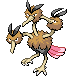
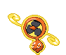

<h1>Introduction</h1>

This is a personalized route for Kanto money guide.

<h3> start with the gym trainers:</h3>
<ul>
    <li><a href="#brock">Brock</a></li>
    <li><a href="#misty">Misty</a></li>
    <li><a href="#ltsurge">Lt. Surge</a></li>
    <li><a href="#erika">Erika</a></li>
    <li></li>
    <li></li>
    <li></li>
</ul>
<h1>Gym Trainer</h1>

<h2 id="brock">Brock</h2>

 

This trainer is located in Pewter City in kanto. Below is the possible lineup the trainer might have:

<ol>
    <li> 
          </li>
    <li>     </li>
    <li>     </li>
    <li>     </li>
    <li>     </li>
</ol>

<h2 id="misty">Misty</h2>

This trainer is located in Cerulan City in kanto. Below is the possible lineup the trainer might have:

<ol>
    <li>     </li>
    <li>     </li>
    <li>     </li>
    <li>     </li>
    <li>     </li>
</ol>

<h2 id="ltsurge">Lt. Surge</h2>

This trainer is located in Vermilion City in kanto. Below is the possible lineup the trainer might have:

<ol>
    <li>     </li>
    <li>     </li>
    <li>     </li>
    <li>     </li>
    <li>     </li>
</ol>

<h2 id="erika">Erika</h2>

This trainer is located in Celadon City in kanto. Below is the possible lineup the trainer might have:

<ol>
    <li>     </li>
    <li>     </li>
    <li>     </li>
    <li>     </li>
    <li>     </li>
</ol>

<h2 id="sabrina">Sabrina</h2>
